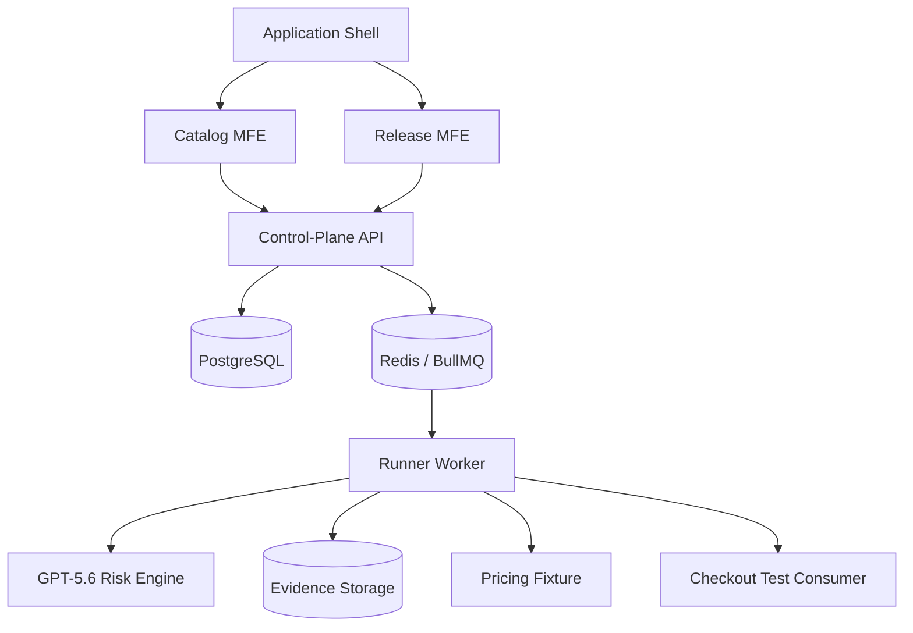
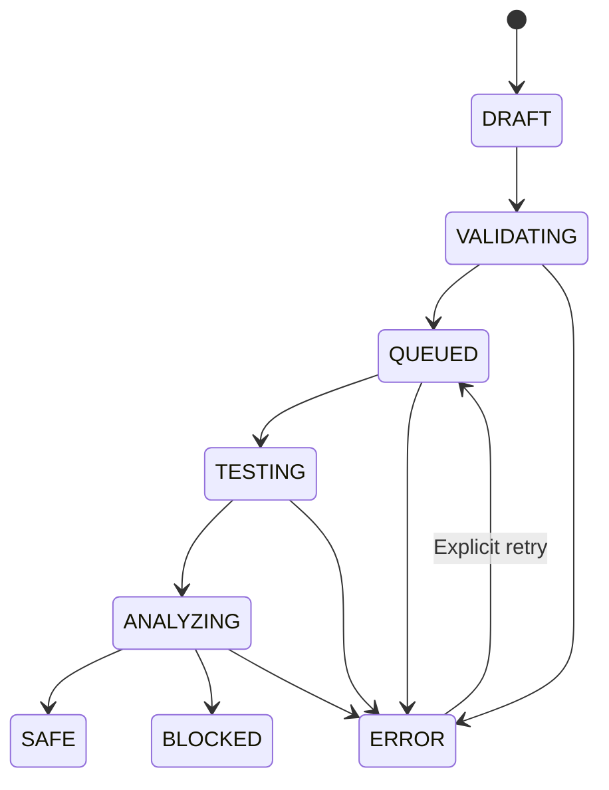

# ReleaseMesh — Final Senior Architect Recommendation

**Architectural status: Approved**

ReleaseMesh will be a **production-shaped developer tool** that protects independently deployed microfrontends and backend services from breaking contract changes.

The architecture is intentionally limited to the smallest system that proves independent deployment, asynchronous test execution, deterministic release gating and meaningful GPT-5.6 intelligence.

## 1. Product definition

> ReleaseMesh is an AI-assisted release-assurance control plane that detects incompatible API changes, identifies affected consumers, runs targeted contract/API/browser tests, captures evidence and uses GPT-5.6 to explain the blast radius and recommend the smallest compatible fix.

**Hackathon category:** Developer Tools

**Target users:** Platform engineers, frontend leads, backend teams and release engineers working with independently deployed applications.

## 2. Approved architecture



### Frontend applications

| Application | Responsibility |
| --- | --- |
| `shell` | Navigation, shared context, remote loading, remote versions and error boundaries |
| `catalog-mfe` | Components, versions, dependencies, contracts and ownership |
| `release-mfe` | Release creation, progress, test results, evidence, risk report and remediation |

Release Centre and Evidence Explorer remain combined in `release-mfe`.

### Backend executable units

| Unit | Responsibility |
| --- | --- |
| `control-plane-api` | Catalogue, dependency graph, release lifecycle, validation and frontend-facing APIs |
| `runner-worker` | Contract comparison, API tests, Playwright tests, retries and artifact collection |
| `risk-engine` | GPT-5.6 test selection, evidence correlation, blast-radius explanation and remediation |

There will be no separate API gateway, catalogue service or orchestration service.

### Infrastructure

* PostgreSQL for persistent system state.
* Redis/BullMQ for background jobs, retries and failed jobs.
* Local or object storage for screenshots, logs and test artifacts.
* Docker Compose for reproducible local execution.
* Structured logs with `releaseId`, `testRunId`, status and timing.
* Polling from `release-mfe` for progress; real-time streaming is outside the MVP.

## 3. Microfrontend requirements

Module Federation must demonstrate genuine architectural value:

* Each remote has its own manifest and build.
* The shell displays the loaded remote version.
* A remote can be deployed without rebuilding the shell.
* Each remote is protected by an error boundary.
* If `catalog-mfe` becomes unavailable, `release-mfe` remains usable.
* Shared React dependencies are configured as singletons.

This prevents the microfrontend design from becoming architecture theatre.

## 4. Demonstration system

Only one controlled scenario will be implemented.

### Components

* Checkout test consumer.
* Pricing API fixture.
* Checkout → Pricing dependency.
* One Pricing endpoint, such as `GET /pricing/:productId`.

### Contract versions

**Pricing v1 — working**

```json
{
  "price": 1299,
  "currency": "INR"
}
```

**Pricing v2 — breaking**

```json
{
  "amount": 1299,
  "currencyCode": "INR"
}
```

**Pricing v2.1 — compatible fix**

```json
{
  "price": 1299,
  "currency": "INR",
  "amount": 1299,
  "currencyCode": "INR"
}
```

### Judge-facing demonstration

1. Show the Checkout application working with Pricing v1.
2. Create a release candidate for Pricing v2.
3. ReleaseMesh detects the renamed response fields.
4. The dependency graph identifies Checkout as affected.
5. GPT-5.6 selects relevant trusted tests.
6. Contract, API and Playwright tests run.
7. The browser test captures the failed Checkout experience.
8. ReleaseMesh marks the release `BLOCKED`.
9. GPT-5.6 explains the blast radius and proposes compatibility aliases.
10. Apply Pricing v2.1 and create a new release.
11. Tests pass and the new release becomes `SAFE`.

## 5. Release lifecycle



Every transition must be persisted with:

* Timestamp.
* Previous and new status.
* Attempt number.
* Reason or error code.
* Correlation identifier.

A crashed worker cannot leave a release permanently in `TESTING`.

## 6. Deterministic release gate

GPT-5.6 must never independently approve or block a release.

The deterministic engine decides:

| Result | Condition |
| --- | --- |
| `SAFE` | No incompatible registered dependency and every mandatory test passed |
| `BLOCKED` | Incompatible contract affects a registered consumer or a mandatory test failed |
| `ERROR` | Required checks could not finish or evidence is insufficient |
| `AI_UNAVAILABLE` | Additional flag shown when the deterministic result exists but GPT analysis failed |

The AI explains the decision; it does not own the decision.

## 7. GPT-5.6 responsibilities

### Planning stage

GPT-5.6 receives:

* Structured contract diff.
* Dependency graph.
* Changed endpoints.
* Available trusted test registry.

It returns validated structured output containing:

* Affected components.
* Tests to run from an allowlisted registry.
* Reason for selecting each test.
* Expected risk areas.

If this call fails, ReleaseMesh runs the mandatory default test suite.

### Analysis stage

After execution, GPT-5.6 receives:

* Contract-diff result.
* API assertions.
* Playwright failure summary.
* Sanitized logs and screenshot metadata.
* Dependency ownership information.

It returns:

* Human-readable root cause.
* Cross-component blast radius.
* Evidence-linked explanation.
* Confidence and uncertainty.
* Smallest compatible remediation proposal.
* Suggested verification steps.

All responses must use a validated JSON schema. Invalid responses are rejected without affecting deterministic test results.

## 8. Core data model

* `Component`
* `ComponentVersion`
* `Dependency`
* `Contract`
* `ReleaseCandidate`
* `ReleaseTransition`
* `TestRun`
* `EvidenceArtifact`
* `RiskAssessment`

A dependency records:

* Consumer component.
* Provider component.
* Expected contract version.
* Required endpoints.
* Owning team.

## 9. Minimum API surface

```text
GET  /components
GET  /components/:id
GET  /dependencies
POST /releases
GET  /releases/:id
POST /releases/:id/retry
GET  /releases/:id/artifacts
```

Release creation must accept an idempotency key to prevent duplicate jobs.

## 10. Failure handling

The implementation must visibly handle:

* GPT-5.6 timeout or invalid output.
* Worker crash and retry.
* Redis unavailability.
* Pricing service timeout.
* Playwright timeout.
* Duplicate release creation.
* Screenshot or artifact-storage failure.
* Unavailable microfrontend remote.

Retryable failures use capped exponential backoff. Permanent validation failures move directly to `ERROR`.

## 11. Security boundary

The hackathon build will:

* Execute only the bundled Checkout/Pricing scenario.
* Select tests only from a trusted registry.
* Reject arbitrary repositories, scripts and URLs.
* Apply execution timeouts.
* Sanitize logs before sending evidence to GPT-5.6.
* Never send API keys, credentials or environment secrets to the model.
* Validate all model output before use.

Running untrusted customer code inside isolated containers is a documented future capability—not part of the hackathon build.

## 12. Testing requirements

Minimum acceptable test suite:

* Unit tests for contract-diff rules.
* Unit tests for state transitions.
* Unit tests for deterministic release-gate decisions.
* Unit tests for GPT structured-output validation.
* Integration test covering API → queue → worker → database.
* Contract test between Checkout and Pricing.
* Playwright test for the broken Checkout flow.
* Idempotent release-creation test.
* GPT timeout and fallback test.
* Worker retry test.
* Microfrontend remote-failure isolation test.
* End-to-end `BLOCKED → compatible fix → SAFE` demonstration.

## 13. Recommended repository structure

```text
releasemesh/
├── apps/
│   ├── shell/
│   ├── catalog-mfe/
│   └── release-mfe/
├── services/
│   ├── control-plane-api/
│   ├── runner-worker/
│   └── risk-engine/
├── fixtures/
│   ├── checkout/
│   └── pricing/
├── packages/
│   ├── contracts/
│   ├── ui/
│   ├── telemetry/
│   └── config/
├── tests/
│   └── e2e/
└── docker-compose.yml
```

## 14. Explicitly excluded from scope

Do not add:

* Product or Order services.
* Separate Evidence microfrontend.
* Separate API gateway.
* Kubernetes.
* Multi-tenant RBAC.
* GitHub repository ingestion.
* Arbitrary test execution.
* User-authored Playwright scripts.
* Full CI/CD provider integrations.
* Complex load-testing dashboards.
* Additional AI agents.

These may be shown as future extensions in the architecture documentation.

## 15. Completion criteria

ReleaseMesh is complete when:

* All three frontend applications load through runtime composition.
* One remote can fail without breaking the shell.
* Pricing v2 produces a persisted `BLOCKED` release.
* Evidence includes the contract diff, API result and browser artifact.
* GPT-5.6 provides an evidence-linked explanation and compatible fix.
* GPT failure does not remove the deterministic result.
* Pricing v2.1 produces `SAFE`.
* Duplicate release requests do not create duplicate jobs.
* The project runs through Docker Compose.
* Judges have a deployed or immediately testable demonstration.
* README documents setup, architecture, Codex collaboration and GPT-5.6 usage.

## Final verdict

**Proceed with this scope and freeze the architecture.**

ReleaseMesh should be described as:

> A production-shaped reference implementation for AI-assisted release assurance across independently deployed microfrontends and backend services.

This version is technically credible, strongly aligned with the Developer Tools judging criteria and achievable without returning to the original thirteen-component design.
